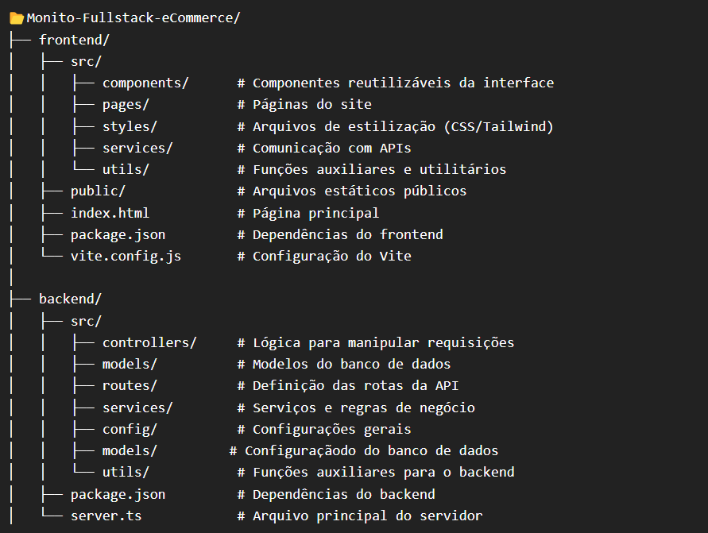
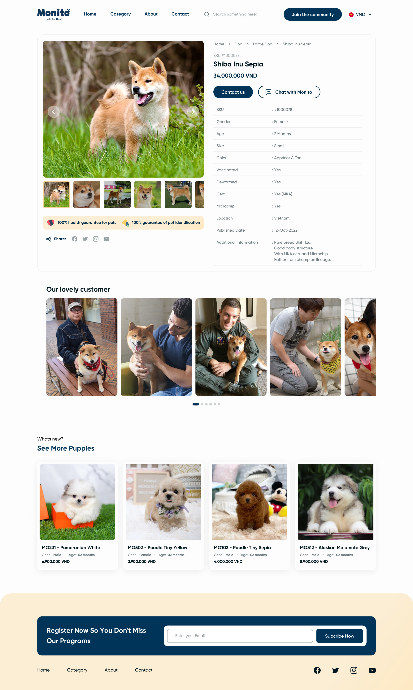

# Monito eCommerce

FullStack eCommerce project with a React Frontend and a Node.js Backend, using NestJS and MongoDB. The goal is to improve web development skills while focusing on best practices in software architecture and programming.

## 🚀 Technologies

This project was developed using the following technologies:

### **Frontend**

-   Node.js, Vite, React
-   HTML, CSS, JavaScript
-   TypeScript
-   Tailwind CSS

### **Backend**

-   Node.js, TypeScript
-   NestJS
-   mongoose, ts-node

### **Database**

-   MongoDB

## 📌 Requirements

### **Main Features**

-   Product category listing
-   Display of featured products on the homepage
-   Product detail visualization
-   Pagination for the product listing
-   Functional filters for product search
-   Mouse hover animation for products
-   Dynamic image display in the product details
-   Contact form for inquiries

### **API Endpoints**

The project's API exposes these endpoints for data retrieval:

-   `GET /categories` - Returns all available categories
-   `GET /products` - Returns the product listing with pagination
-   `GET /product/:id` - Returns details of a specific product

## 📂 Folder Structure



## 🎨 UI/UX

The application's design follows a predefined Figma model, ensuring an intuitive interface aligned with best usability practices.



## 💻 How to Run the Project

### **Prerequisites**

Before starting, ensure you have installed:

-   Node.js
-   A package manager (npm or yarn)

### **Steps**

1. Clone this repository:

    ```sh
    git clone https://github.com/your-username/repository-name.git
    ```

2. Install frontend and backend dependencies:

    ```sh
    cd frontend
    npm install
    cd ../backend
    npm install
    ```

3. Run the project:

    - For the frontend:

        ```sh
        cd frontend
        npm run dev
        ```

    - For the backend:

        ```sh
        cd backend
        npm run start:dev
        ```

4. Access the frontend at `http://localhost:<port>` and the backend at `http://localhost:<port>`
